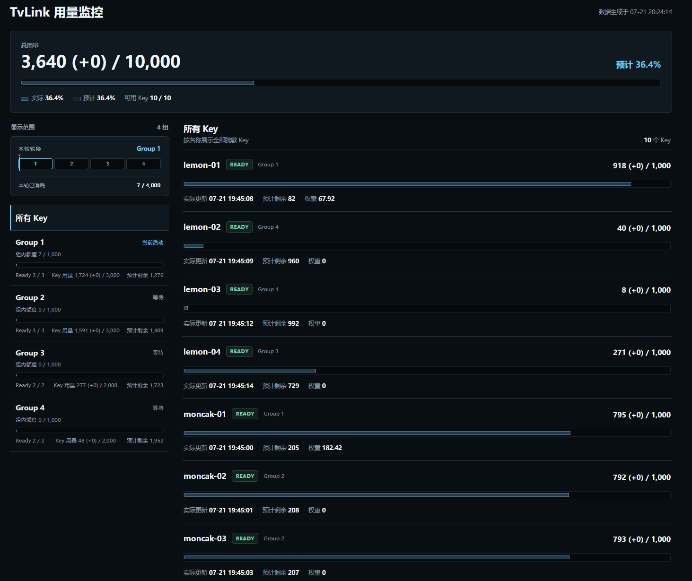

# TvLink

TvLink 是一个 Tavily API Key 池服务，向客户端提供统一的 REST 与 MCP 入口，并显示各 Key 的用量状态。



## 功能

- 为多个 Tavily API Key 按可用额度分配请求；遇到限流时自动切换并冷却 Key。
- 代理 Tavily REST 接口：`/search`、`/extract`、`/crawl`、`/map` 和 `/research`。
- 在 `/mcp` 提供经过认证的 Streamable HTTP MCP 服务。
- 根路径 `/` 提供自动刷新的用量监控页。

## 配置

从 [`tvlink.example.toml`](tvlink.example.toml) 创建 `tvlink.toml`，至少设置客户端使用的 `tvlink_api_key`，以及一个或多个 `tavily_keys`。

客户端调用 REST 和 MCP 时使用 `Authorization: Bearer <tvlink_api_key>`。默认监听 `:8080`；监控页地址为 `http://<host>:8080/`。

### Key 分组轮换

可选地配置 `key_group_size`、`group_usage_limit` 和 `group_rotation_timezone`，让 TvLink 将可用 Key 按剩余额度均衡分组，并在当前组累计消耗固定的预估 Tavily credits 后轮换下一组。时区使用 IANA 名称，例如 `Asia/Shanghai`；月度边界和所有组完成一轮后会刷新用量并重新均衡分组。单把 Key 耗尽不会立刻重分组。

分组只控制同一出站 IP 下的 Key 使用节奏，不会改变服务的出站 IP。

## 部署

Release 提供 `win_amd64` 和 `linux_amd64` 预编译包。下载并解压与目标平台匹配的包即可运行；Windows 直接执行 `tvlink.exe -config tvlink.toml`。

使用 `tvlink --version` 查看版本。Release 构建通过 `-ldflags` 注入标签，例如：

```bash
go build -ldflags "-X main.version=v1.2.3" -o tvlink ./cmd/tvlink
```

以下以 Linux `linux_amd64` 包部署到 `/opt/tvlink` 为例：

```bash
sudo useradd --system --home /opt/tvlink --shell /usr/sbin/nologin tvlink
sudo install -d -o root -g tvlink -m 0750 /opt/tvlink

# 将 linux_amd64 包中解压出的 tvlink 与配置文件放入目标目录。
sudo install -o root -g root -m 0755 tvlink /opt/tvlink/tvlink
sudo install -o root -g tvlink -m 0640 tvlink.example.toml /opt/tvlink/tvlink.toml
sudoedit /opt/tvlink/tvlink.toml

sudo install -o root -g root -m 0644 tvlink.service /etc/systemd/system/tvlink.service
sudo systemctl daemon-reload
sudo systemctl enable --now tvlink
sudo systemctl status tvlink
```
