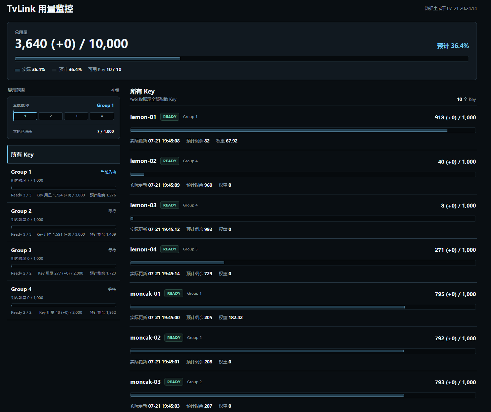

# TvLink

TvLink 是一个 Tavily API Key 池服务，向客户端提供统一的 REST 与 MCP 入口，并显示各 Key 的用量状态。



## 功能

- 为多个 Tavily API Key 按可用额度分配请求；遇到限流时自动切换并冷却 Key。
- 代理 Tavily REST 接口：`/search`、`/extract`、`/crawl`、`/map` 和 `/research`。
- 在 `/mcp` 提供经过认证的 Streamable HTTP MCP 服务。
- 根路径 `/` 提供静态交互式用量监控页，可查看全部 Key 或按组筛选。

## 配置

从 [`tvlink.example.toml`](tvlink.example.toml) 创建 `tvlink.toml`，至少设置客户端使用的 `tvlink_api_key`，以及一个或多个 `tavily_keys`。

客户端调用 REST 和 MCP 时使用 `Authorization: Bearer <tvlink_api_key>`。默认监听 `:8080`；监控页地址为 `http://<host>:8080/`。页面不会自动刷新；需要最新用量时手动刷新浏览器。

### Key 分组轮换

可选地配置 `key_group_size`、`group_usage_limit` 和 `group_rotation_timezone`，让一批 Key 形成较长且稳定的使用窗口。它适合在固定出站 IP 下控制 Key 的使用节奏，避免全池 Key 在短时间内同时参与分配；控制节奏的目的，是避免整池流量呈现为一次明显的同源负载均衡。分组不会改变服务的出站 IP——它控制的是节奏，不是身份。

启动、跨月或一轮全部组完成时会重建分组：用池内已知的剩余额度把 Key 分配到大小尽量均匀的组中，随后在后台补刷权威用量（只补刷节流已到期的 Key）。分配会在满足组大小约束的所有组合里，优先最小化各组剩余额度的最大差值，再最小化方差；因此不同套餐或已有不同用量的 Key 也会得到尽可能均衡的组承载力。

请求只会在当前活动组内按剩余额度加权选择 Key。本组累计的预估 Tavily credits 到达 `group_usage_limit` 后，下一次请求切到后续组；429 和确定性不计费的 4xx 会回滚对应的组用量。单把 Key 耗尽不会立即打散分组，只有整个重建时机到来才重新计算成员归属。时区使用 IANA 名称，例如 `Asia/Shanghai`。

启用分组后，监控页左侧以竖排列表显示各组汇总用量，并保留真实/预估双层进度条；右侧可在全部 Key 和单个组之间切换。移动端使用下拉选择，页面筛选完全在已渲染的静态 HTML 内完成。

### 用量刷新

`usage_refresh_interval` 是每把 Key 两次 `/usage` 刷新的周期。刷新按「组为槽」错峰：周期按组数均分，一个组在自己的槽内刷新全部成员，组间错开，槽边界与槽内都带随机抖动；未启用分组时按 Key 配置顺序均匀铺开。启动时先做一次全量刷新（唯一一次连发），并作为各 Key 节流的起点。

Tavily 对 `/usage` 有独立限流（10 次/10 分钟，按 Key），因此所有刷新入口——定时槽、分组重建后的补刷、Research 结算——共用同一份每 Key 节流：成功后等一个周期，失败等 2 分钟，429 按 `Retry-After`（缺省 300 秒）退避并沿用旧快照。监控页顶部状态条显示最近一批刷新的结果，以及近周期请求总数、60 秒内最大连发和近 10 分钟 429 计数。

## 部署

Release 提供 `win_amd64` 和 `linux_amd64` 预编译包。下载并解压与目标平台匹配的包即可运行；Windows 直接执行 `tvlink.exe -config tvlink.toml`。

使用 `tvlink --version` 查看版本。Release 构建通过 `-ldflags` 注入标签，例如：

```bash
go build -ldflags "-X main.version=v1.2.3" -o tvlink ./cmd/tvlink
```

以下以 Linux `linux_amd64` 包部署到 `/opt/tvlink` 为例：

```bash
sudo useradd --system --home /opt/tvlink --shell /usr/sbin/nologin tvlink
sudo install -d -o root -g tvlink -m 0750 /opt/tvlink

# 将 linux_amd64 包中解压出的 tvlink 与配置文件放入目标目录。
sudo install -o root -g root -m 0755 tvlink /opt/tvlink/tvlink
sudo install -o root -g tvlink -m 0640 tvlink.example.toml /opt/tvlink/tvlink.toml
sudoedit /opt/tvlink/tvlink.toml

sudo install -o root -g root -m 0644 tvlink.service /etc/systemd/system/tvlink.service
sudo systemctl daemon-reload
sudo systemctl enable --now tvlink
sudo systemctl status tvlink
```
